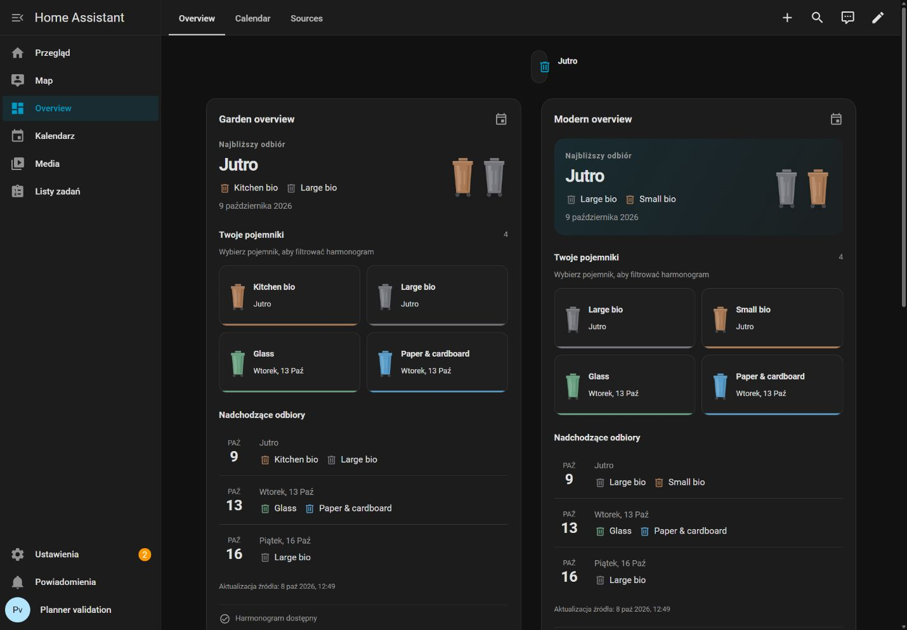
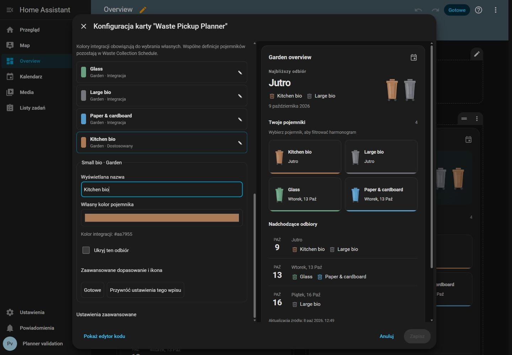
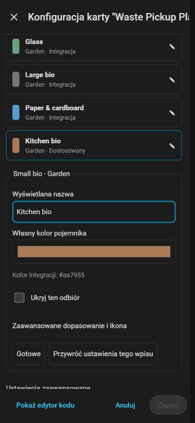

# Waste Pickup Planner

Waste collection dates for Home Assistant, grouped by day. Choose a bin overview, a compact card, a hero with optional bin illustrations, a schedule list, or a dashboard badge.



The card reads Home Assistant sensors and calendars. It does not contact municipality services, need another account, or control physical devices.

See [quality qualification](docs/quality.md) for the card's acceptance criteria,
reproducible checks, and remaining evidence gaps.

## Install

### HACS custom repository

Add `EvotecIT/lovelace-waste-pickup-planner` as a **Dashboard** custom repository in HACS, then download Waste Pickup Planner. For a preview release, enable beta versions when choosing the download version. Reload the browser after installation.

HACS installs the resource at:

```yaml
url: /hacsfiles/lovelace-waste-pickup-planner/waste-pickup-planner-card.js
type: module
```

This is a custom repository; it is not included in HACS's default catalog.

### Manual installation

Download `waste-pickup-planner-card.js` from [Releases](https://github.com/EvotecIT/lovelace-waste-pickup-planner/releases), copy it to `config/www/waste-pickup-planner-card.js`, and add `/local/waste-pickup-planner-card.js` as a JavaScript module in **Settings → Dashboards → Resources**. One file registers both the card and badge. No additional artwork files are required.

## Choose a source

For [Waste Collection Schedule](https://github.com/mampfes/hacs_waste_collection_schedule), select a sensor with **Generic** details. This exposes structured `upcoming` records. Its usual date-keyed details mode is intended for native entity displays and does not supply the structured records this card uses.

Choose the combined sensor to display all bins for an address. In the integration's visual bin controls, Generic is labeled **All attributes**. The card editor suggests structured sensors and calendars; a saved sensor with another details format shows instructions for changing it.

Alternatively, select a Home Assistant calendar:

```yaml
type: custom:waste-pickup-planner-card
entity: calendar.waste_collection
layout: compact
```

Use one authoritative source for each address. Multiple explicit sources are supported through `entities`, but the card does not infer which sensors or calendars represent the same address. Selecting both a combined sensor and its calendar can show both representations. Separate selected sources retain their identity even when dates and names match.

## Layouts

```yaml
type: custom:waste-pickup-planner-card
entity: sensor.waste_schedule
layout: hero
show_artwork: true
days_to_show: 30
max_groups: 4
```

- **Compact** shows the next date, up to six collection names, and a count of any additional collections.
- **Hero** adds optional bin artwork and upcoming date groups.
- **Schedule** shows date-grouped rows.
- **Overview** shows the next pickup, each supplied bin's next date, a filterable schedule, and source status. Select a bin to filter the upcoming list and schedule dialog; select it again or choose **Show all bins** to clear the filter. Bin lists longer than 12 entries have page controls.
- **Badge** shows the next date and collection names or a count. Its accessible description includes up to six complete names; the default action opens all collections. Add it to a view's badges:

```yaml
type: custom:waste-pickup-planner-badge
entity: sensor.waste_schedule
```

Visible date groups show up to six complete collection names and an overflow count. The default action opens the full schedule for the configured date range, in pages of 100 collections. The dialog supports keyboard navigation and Escape to close. English and Polish interface labels are included; dates follow Home Assistant's language and home timezone.

For an overview with a tinted header and tighter spacing:

```yaml
type: custom:waste-pickup-planner-card
entity: sensor.waste_schedule
layout: overview
appearance: modern
density: compact
```

**Native Home Assistant**, **Modern**, and **Minimal** appearance presets use the active HA theme. Comfortable spacing is the default. These options change presentation; provider and local bin colors retain their existing meaning. The overview shows bins present in the supplied date range, rather than inferring a complete physical-bin inventory. Identical labels from different selected sources remain separate. Source names appear on tiles by default when multiple sources are selected.

## Configuration

Both components have visual editors. Advanced YAML uses the same options:

| Option | Default | Purpose |
| --- | --- | --- |
| `entity` | Required unless `entities` is set | Sensor or calendar ID |
| `entities` | — | Up to 12 explicit sources; do not also set `entity` |
| `title` | Localized “Waste collection” | Card heading |
| `layout` | `compact` | `compact`, `hero`, `schedule`, or `overview` |
| `appearance` | `native` | `native`, `modern`, or `minimal`; card presentation |
| `density` | `comfortable` | `comfortable` or `compact`; card spacing |
| `show_source` | Multiple sources | Source names on overview bin tiles |
| `days_to_show` | `30` | Range beginning today in the home timezone, 1–366 days |
| `max_groups` | `5` | Visible date groups, 1–50; details show the full range |
| `show_artwork` | `true` in overview; `false` otherwise | Decorative bins in hero and overview |
| `show_updated` | `false` | Display the sensor's provider-backed `last_update` attribute when present |
| `show_manage_bins` | `false` | Card shortcut to the Waste Collection Schedule integration page |
| `locale` | HA language | Optional language code such as `pl` or `en-GB` |
| `overrides` | — | Exact collection names/IDs, display names, icons, colors, visibility |
| `tap_action.action` | `details` | `details`, `more-info`, `navigate`, or `none` |
| `tap_action.navigation_path` | — | Local dashboard path for `navigate` |

`layout`, `max_groups`, `show_artwork`, `show_manage_bins`, `appearance`, `density`, and `show_source` do not change the badge presentation. `more-info` opens the first selected entity. Overview source buttons open the corresponding entity's native details.

### Visual bin colors

The visual editor starts with **Source and layout**, followed by **Appearance** and **Bins**. Select a bin to open its editing panel, then pick a local color, change its display name, or hide it. Only one panel opens at a time. **Use integration color** removes the local color override; **Reset this override** removes that bin's local settings. Category matching, icons, date-range settings and tap actions stay under **Advanced settings**. The editor follows HA's English or Polish language setting.

Settings affect this card or badge; manage bin definitions and shared colors in Waste Collection Schedule. Enable **Show Manage bins shortcut** on a card to open that integration's native management page.



<details>
<summary>Bin controls on mobile</summary>



</details>

Bins with different names remain separate when they share a canonical category and collection date, including when local display names match. A visual override records the selected source entity and complete original bin name. If you rename that bin in the integration, reselect it in the card editor. Calendar bins also appear in the ordinary visual list after their events load; discovery uses the configured date range. For bins absent from the supplied records, use **Advanced settings → Add a category or missing bin override**.

```yaml
type: custom:waste-pickup-planner-card
entity: sensor.waste_schedule
layout: hero
show_artwork: true
overrides:
  - type: bio
    name: Food and garden
    color: '#9A6C45'
    icon: mdi:leaf
  - type: Payment reminder
    hidden: true
```

`type` matches a v3 `type_id`, or the complete collection label when no ID exists. Names containing commas remain a single label. Colors must use `#RRGGBB`; icons must use `mdi:…`.

Optional `source` and `label` restrict an override to one source and its exact bin name. For example, two bio bins can keep separate local colors:

```yaml
overrides:
  - type: organic
    source: sensor.waste_schedule
    label: Small bio
    color: '#123456'
```

Specific bin settings take precedence over broader category settings, per field. Within the same scope, the first matching override wins. A local card color takes precedence over the integration's effective color; removing it inherits the broader card override, if present, otherwise the integration color. The integration owns provider and shared category defaults.

Bin artwork uses provider/customized color metadata or an explicit override. Category-default colors may color an icon, but never claim the color of your physical bin. Calendar-only sources have neutral bins unless you configure overrides.

## Themes and unavailable sources

Cards inherit Home Assistant's card background, text, divider, radius, shadow, and primary-color variables. Light, dark, and custom themes need no separate configuration.

An empty date range is distinct from an unavailable source. If a source fails after loading, the card keeps its last schedule in memory and labels it as potentially out of date. Reloading the page clears that cache. A state-change timestamp is never presented as a provider refresh time.

Calendar reads are shared across instances on the same HA connection while pending and for one minute after completion. Detached components stop publishing results and remove their timers/listeners; requests already issued through HA's `callApi` may finish in the background.

## Native Home Assistant alternatives

Existing sensors also work without this frontend. For a built-in [entity badge](https://www.home-assistant.io/dashboards/badges/):

```yaml
type: entity
entity: sensor.next_waste_pickup
name: Waste
show_name: true
show_state: true
tap_action:
  action: more-info
```

For a native Tile or Entities card:

```yaml
type: tile
entity: sensor.next_waste_pickup
name: Next collection
```

```yaml
type: entities
entities:
  - sensor.next_waste_pickup
  - sensor.bio
```

Native cards display the sensor's own state. They do not gain this card's grouping or color logic.

## Development

Use Node.js 24:

```sh
npm ci
npm test
npm run check
npm run pack
npm run preview
```

The standalone preview runs at `http://127.0.0.1:4174` with synthetic data, theme switching, and empty/stale/unavailable states. Home Assistant supplies the actual host components in production.

`src/` separates input adapters, calendar-date calculations, shared projection/controller, rendering, and visual editors. `tests/` covers the sensor/calendar contracts and lifecycle behavior. The one-file build uses Lit and esbuild. Releases use the same shared PowerForge Home Assistant workflow as [Lawn Mower Card](https://github.com/EvotecIT/lovelace-lawn-mower-card).

See [architecture and compatibility](docs/design-and-api.md) for the tested data boundaries. Concept images in `docs/design/` are design references, not application screenshots.

MIT license.
